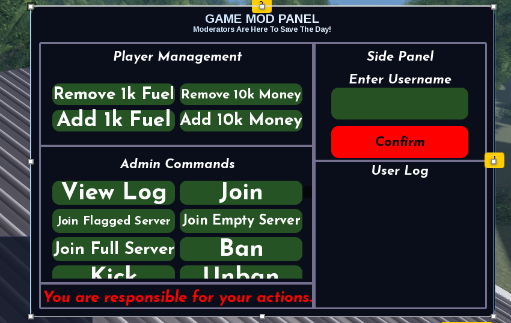
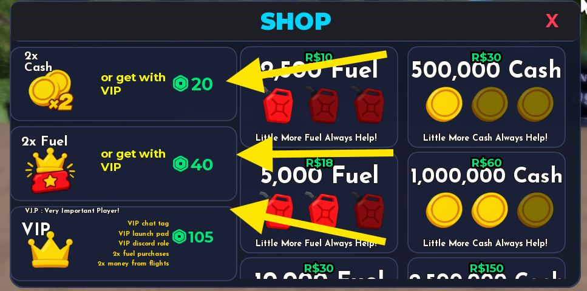
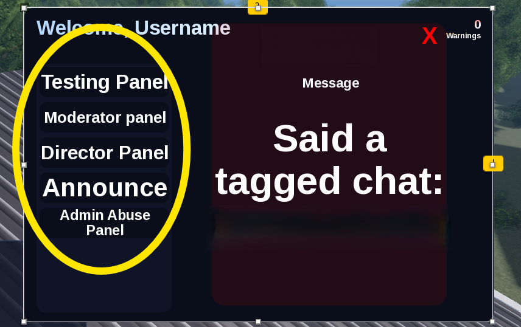

# Lift

> Roblox Developer - Lead Scripter
> August 12, 2026 - Present

## Overview
**Lift** is an existing Roblox project I joined as a devoloper. I contributed to the game's scripting and UI development, focusing on implementing new features, fixing bugs, improving existing systems, optimizing scripts, and improving the game's UI and responsiveness.

## My Role
Lead Scripter (occasionally developing in UI)

## Contributions

### Scripts
- Developed and fixed gameplay, staff, and moderator systems.
- Implemented permission-based staff functionality and moderator commands.
- Created automatic moderation logging and log viewing.
- Fixed fuel, money, teleportation, and gamepass-related features.
- Updated deprecated Roblox APIs and removed duplicates.

### UI
- Improved mobile and responsive UI behavior.
- Redesigned the Staff and Moderator panels.
- Implemented permission-baseed UI buttons.
- Imporved the Gamepass Shopmlayout, pricing display, and ownership indicator.

### Other
- Debugged and maintained existing game system.
- Fixed various gameplay and functionality issues.
- Worked with the exisitng developmeny team to implement requested features and improvements.

## Highlights

### Moderator Panel

**My contributions:** 
- Redesigned the panel layout and scripted majority of the button's functionality.
- Developed a automatic logging feature, and a view log for viewing selected user log.

### Gamepass UI

**My contributions:**
- Improved the responsive UI layouts for different screen sizes and devices.
- Implemented a dynamic gamepass price script that atuomatically update to the actual gamepass price.
- Developed a ownership indicator.

### Permission-based Buttons

**My contributions**
- Improved the responsive UI layouts for different screen sizes and devices.
- Implemnted the permission-based buttons that check a player's group rank and only display buttons they have access to.

### Development Log
- Aug 10: Fixed script sandbox/capability issues and reworked the Admin Panel to retrieve player roles through the server. Updated the Group ID.
- Aug 11: Fixed RolePermissions errors, completed Sell All Fuel, removed duplicate scripts, and replaced deprecated MembershipType usage with HasRobloxPremium.
- Aug 12: Improved mobile UI responsiveness by adjusting ScreenInsets and removing an incompatible viewport script.
- Aug 13: Improved small-screen layout and implemented the Staff-Only Panel, showing only buttons the player has permission to use.
- Aug 14: Completed staff permission buttons, fixed the FuelBox, added indicators for already-owned gamepasses, and enforced landscape UI.
- Aug 15: Fixed BoughtLabel, resolved the Structure asset requiring issue, improved Shop gamepass scaling, and made VIP ownership count as 2x Cash.
- Aug 16: Organized gamepass frames and made shop prices automatically reflect the actual Roblox gamepass prices.
- Aug 17: Fixed city teleportation and the Staff Panel, added Fly and Kill moderator buttons, redesigned the Moderator Panel, and implemented an automatic moderation log with View Log. Most moderator commands were completed, except server-joining commands.
- Aug 18: Added moderator commands for Add/Remove 1K Fuel and Add/Remove 10K Money.

### Links
- Game: [Lift](https://www.roblox.com/games/72896428980710/Lift)
- Roblox Group: [Lift Entertainment](https://www.roblox.com/communities/357815619/Lift-Entertainment)
- Discord Server: [Lift Enteertainment](https://discord.gg/u9hyUSGTbH)